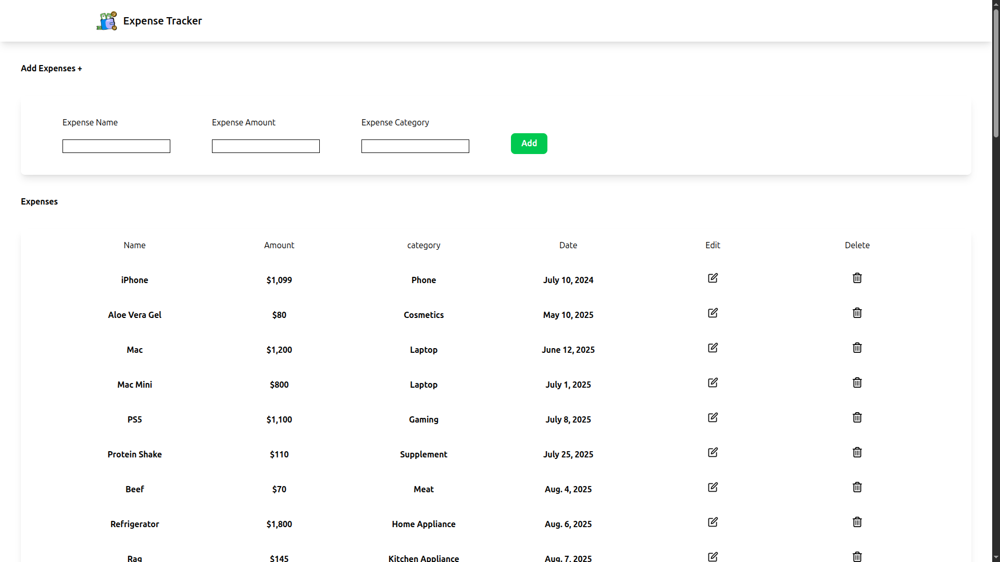
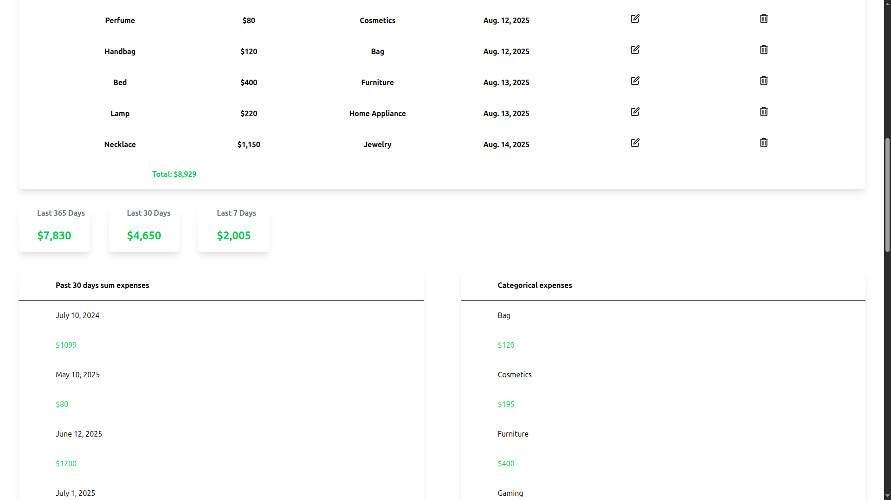
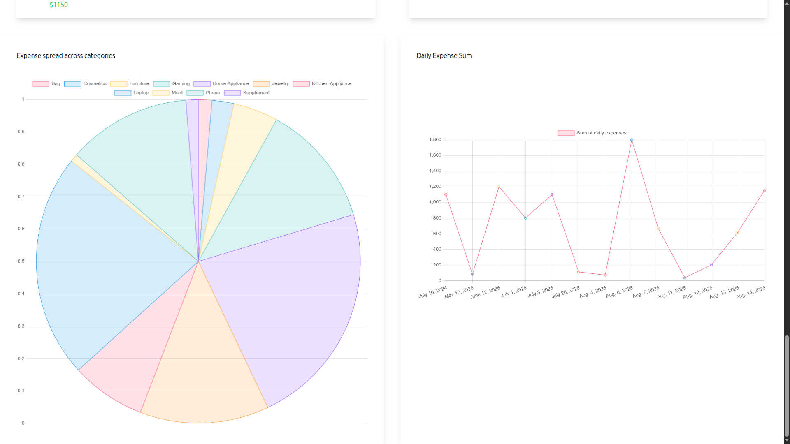

# 📊 Expense Tracker

An easy-to-use **Expense Tracking Web App**
Track and analyze your expenses with **daily**, **last 7 days**, and **last 30 days** summaries — all visualized with interactive charts.

---

## ✨ Features

- **Add, edit, and delete** expense entries.
- **Automatic summaries**:
  - **Daily** total.
  - **Last 7 days** total.
  - **Last 30 days** total.
- **Interactive charts** to visualize expense trends.
- **Responsive UI** with Tailwind CSS.
- **Secure backend** built with Django.
- **Environment isolation & dependency management** with Poetry.

---

## 🛠️ Tech Stack

- **Backend:** Python, Django
- **Frontend:** Tailwind CSS
- **Package Manager:** Poetry
- **Charts:** Chart.js
- **Database:** SQLite (default, configurable to PostgreSQL/MySQL)

---

## 📂 Project Structure

```
expense-tracker/
│
├── expense_tracker/         # Django project settings
├── et_app/                # Main app for expense logic
├── templates/               # HTML templates
├── static/                  # Tailwind & other static files
├── pyproject.toml           # Poetry dependencies
├── README.md
└── ...
```

---

## 🚀 Installation & Setup

> **Requirements:**
>
> - Python **3.13+**
> - Poetry **1.8+**
> - Node.js & npm (for Tailwind CSS)

### 1️⃣ Clone the repository

```bash
git clone https://github.com/CioFlingar/Expense-Tracker.git
cd expense-tracker
```

### 2️⃣ Install Python dependencies (Poetry)

```bash
poetry install
```

### 3️⃣ Activate Poetry environment

```bash
poetry env activate
```

### 4️⃣ Install Tailwind CSS

```bash
npm install
```

_(Ensure `package.json` contains Tailwind setup. If missing, run:)_

```bash
npm install -D tailwindcss postcss autoprefixer
npx tailwindcss init
```

### 5️⃣ Apply migrations

```bash
python manage.py migrate
```

### 6️⃣ Create a superuser (admin access)

#### Fillup your preffered details

```bash
python manage.py createsuperuser
```

### 7️⃣ Run the Tailwind build process

```bash
npx tailwindcss -i static/et_app/input.css -o static/et_app/output.css --watch
```

### 8️⃣ Start the development server

```bash
poetry run python manage.py runserver
```

Now open your browser and visit: **`http://127.0.0.1:8000`**

---

## 📊 Usage

1. **Login** to your account (create via admin panel or signup page).
2. **Add new expenses** with amount, category, and description.
3. View:
   - **Daily summary**
   - **Last 7 days**
   - **Last 30 days**
4. See your spending habits in **interactive charts**.

---

## Gif

<p align="center">
  
</p>

## 📸 Screenshots

<p align="center" style="margin:0; padding:0;">
  
  
  
</p>
---

## 🔮 Future Improvements

- Export data to **CSV / Excel / PDF**.
- Category-wise breakdown.
- Multi-user support with individual dashboards.
- Mobile-first PWA version.

---

## 🤝 Contributing

1. Fork the repository.
2. Create a new branch:
   ```bash
   git checkout -b "feature-name"
   ```
3. Commit changes:
   ```bash
   git commit -m "Add feature"
   ```
4. Push branch:
   ```bash
   git push origin "feature-name"
   ```
5. Open a Pull Request.

---

## 📜 License

This project is licensed under Me(Cio).

---

## 💡 Author

**[Walid Hasan](https://github.com/CioFlingar)**
**[LinkedIn](https://www.linkedin.com/in/walid-hasan-/)**
💌 Email: eng.walidhasan@gmail.com
